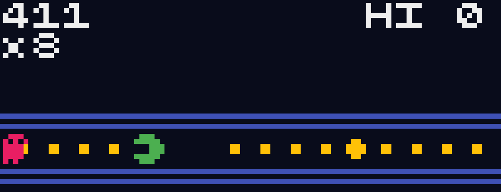

# pakupaku-ai 👾
A simple bot for playing the 1D PAC-MAN game PakuPaku by ABA Games. The [highest score](./assets/best-score.gif) it has reached is 43000.


[
](https://creme332.github.io/pakupaku-ai/?pakupaku)
[
](https://abagames.github.io/crisp-game-lib-11-games/?pakupaku)

## Features

- A refactored version of the original game
- An interface for writing your own bot
- 2 bot strategies
## Installation
> 🔴 **Requirements**: Git, Node.js 

Clone repository:
```bash
git clone git@github.com:creme332/pakupaku-ai.git
```

Install dependencies:
```bash
cd pakupaku-ai
npm install
```

## Usage

To run bot:
```
npm run start
```

Open http://localhost:4000/?pakupaku in your browser then tap on the screen once to start the game.

> 🟢 **Tip**: You can paste the code in `bot.js` directly into the console of the [original game](https://abagames.github.io/crisp-game-lib-11-games/?pakupaku).
> 
### Create your own bot

The default bot strategy used is `creme332Strategy`. You can easily create your own bot by creating your strategy function inside `botController` and then calling it in the `main` function.

All code for the bot is found in `docs/pakupaku/bot.js`. 

## Game modifications
A few modifications were made to the original game to improve testing and readability:
- Turned off sound
- Turned off game replay
- Added a couple of comments

## Limitations
The `creme332Strategy` has several limitations:
- It can end up in a situation where it takes a very long time to eat the dots in the middle: 

    
- It can move too close to the respawn point of the enemy and is unable to escape when enemy revives. 
  
    

## To-do
- [ ] if distance between player and power up is small, go for powerup instead of fleeing
- [ ] Rewrite other algorithms using interface
- [ ] Improve `interface`:
    - [ ] add get functions for `eye` of enemy
    - [ ] add `powerTicks`
- [ ] Add more documentation for original game code in `main.js`

## References
- Code for pakupaku game: https://abagames.github.io/crisp-game-lib-11-games/pakupaku/main.js
- Other bot algorithms: https://news.ycombinator.com/item?id=38845510


